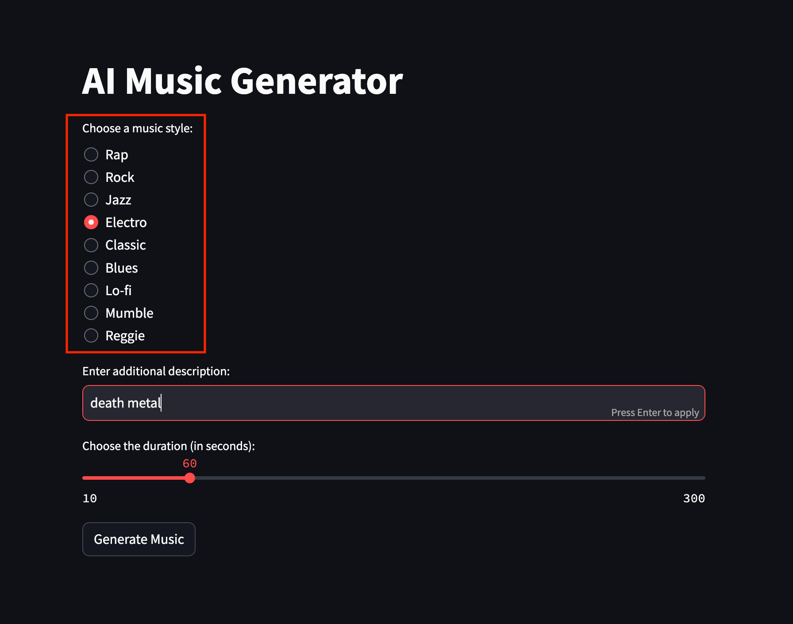

# AI Музыкальный Генератор на основе musicgen-stereo-small

## Описание
Это приложение использует возможности искусственного интеллекта для создания уникальной музыки на основе заданных параметров. Пользователи могут выбрать стиль музыки, добавить описание и установить желаемую длительность трека.

Подробнее про данную модель по ссылке:
 https://huggingface.co/facebook/musicgen-stereo-small

## Технологии
- Python
- Streamlit
- Transformers
- PyTorch
- SoundFile

## Установка и Запуск
Для работы приложения требуется установленный Python и следующие библиотеки: `streamlit`, `soundfile`, `torch`, `transformers`. 

Чтобы запустить приложение, выполните следующие шаги:
1. Клонируйте репозиторий на свой компьютер.
2. Запустите Streamlit приложение с помощью скрипта `run.sh`.
3. Перейдите по ссылке в консоли

## Использование
После запуска приложения:
1. Выберите музыкальный стиль из предложенных вариантов.

3. Введите дополнительное описание для музыки.

4. Установите желаемую длительность музыкального трека.

4. Нажмите кнопку "Генерировать музыку".

5. Дождитесь генерации музыки и прослушайте результат.
6. Вы можете скачать сгенерированный трек, используя кнопку "Скачать музыку".
